<div align="center">

# 🏠 DevOps Full-Cycle Homelab Platform

**A production-grade homelab that mirrors real enterprise DevOps practices —**
**from bare-metal provisioning to GitOps, observability, DR, and workflow automation.**


[](LICENSE)

</div>

<div align="center">

| 🖥️ **2 bare-metal hosts** | ☸️ **3-node Kubernetes** | 🚀 **17 apps via GitOps** | 💾 **~3 min DR restore** | 📊 **Full observability** | 📚 **31 lessons documented** |
|:-:|:-:|:-:|:-:|:-:|:-:|

</div>

---

## 🎯 What Is This?

This is a **Production-grade Platform Engineering Lab** — a complete operational stack equivalent to what a mid-size company (50–500 people) would run, deployed entirely on bare-metal without a single cloud provider.

**This is a live operational platform, not a Docker Compose tutorial.** It includes:

- **Hypervisor layer**: 2 physical Proxmox VE 8.3 hosts managed via Terraform IaC — reproducible VM creation with a single command
- **Kubernetes from scratch**: cluster bootstrapped with `kubeadm` (not managed EKS/GKE), 3 nodes, containerd runtime, Calico CNI, MetalLB L2 — deep understanding of Kubernetes internals
- **GitOps App-of-Apps**: 17 applications synced via Argo CD — what is in Git is what is in the cluster. Pattern used by Netflix, Uber, Spotify
- **Full Observability**: Prometheus v3.10 + Grafana 12.4 + Loki v3.4 + Alertmanager → Telegram. Logs, metrics, alerts — out of the box for every application
- **Backup & Disaster Recovery**: Velero + Longhorn BackupTarget → MinIO S3. DR drill verified: full namespace restore in ~3 minutes
- **CI/CD**: GitHub Actions + ARC (Actions Runner Controller) — self-hosted runners inside K8s, automatic wiki rebuild and deploy on every push
- **Secrets Management**: Sealed Secrets v2.18.3 — encrypted secrets stored in Git, decrypted only inside the cluster
- **Zone Topology**: nodes distributed across two availability zones (zone-a: pve01, zone-b: pve02). Zone A failure test passed: all services migrated to zone-b without data loss
- **TLS everywhere**: cert-manager + internal CA, all services accessible via HTTPS through Ingress-NGINX

> **No managed Kubernetes, no cloud provider.** Everything runs on bare-metal Proxmox VMs.

---

## 🏗️ Architecture Overview

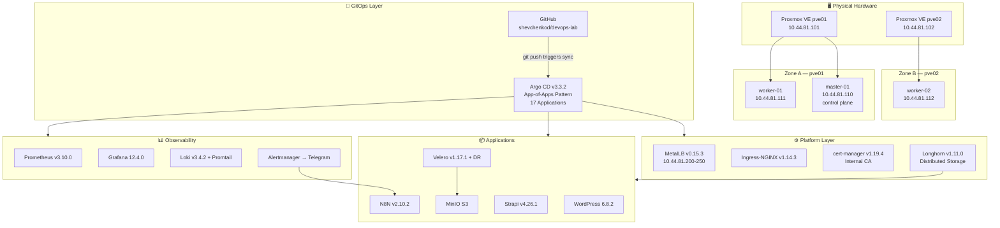

---

## 📸 Screenshots

<table>
  <tr>
    <td align="center" width="50%">
      <b>Argo CD — 17 Apps Synced / Healthy</b><br/>
      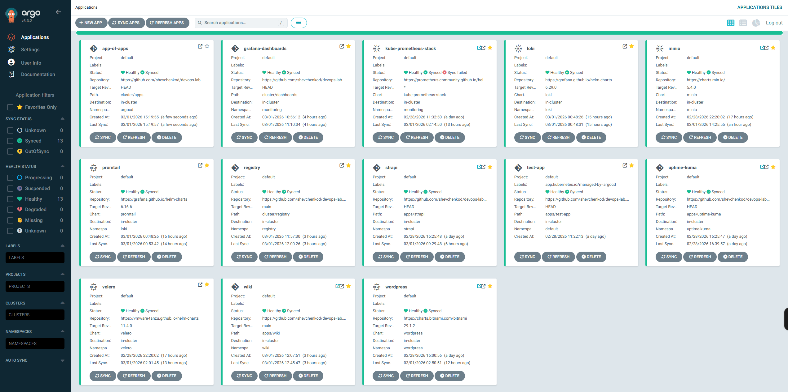
    </td>
    <td align="center" width="50%">
      <b>Argo CD — App-of-Apps Detail</b><br/>
      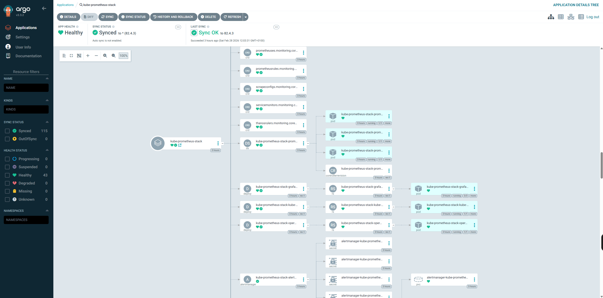
    </td>
  </tr>
  <tr>
    <td align="center" width="50%">
      <b>Grafana — Kubernetes Cluster Dashboard</b><br/>
      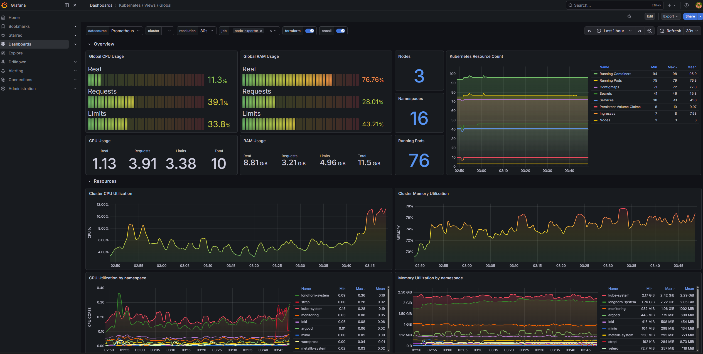
    </td>
    <td align="center" width="50%">
      <b>Grafana — Node Exporter Metrics</b><br/>
      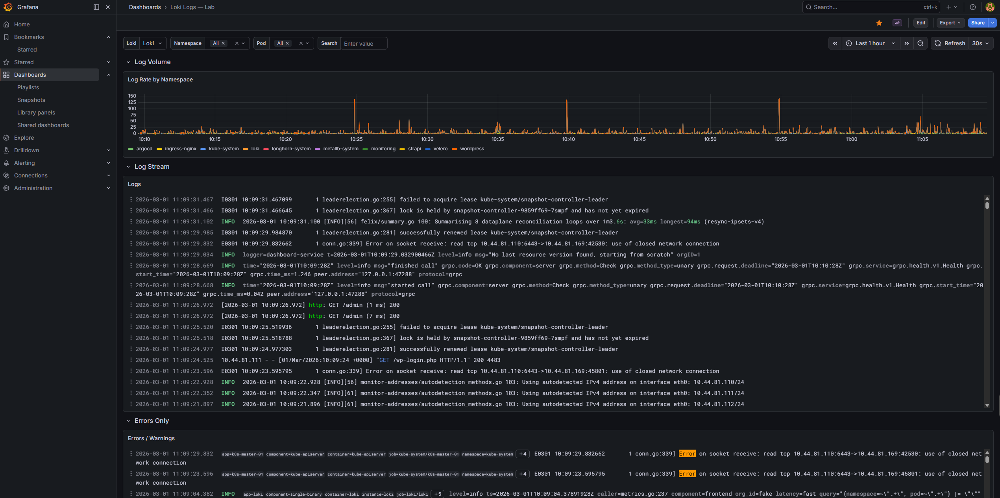
    </td>
  </tr>
  <tr>
    <td align="center" width="50%">
      <b>Uptime Kuma — All lab.local Services Green</b><br/>
      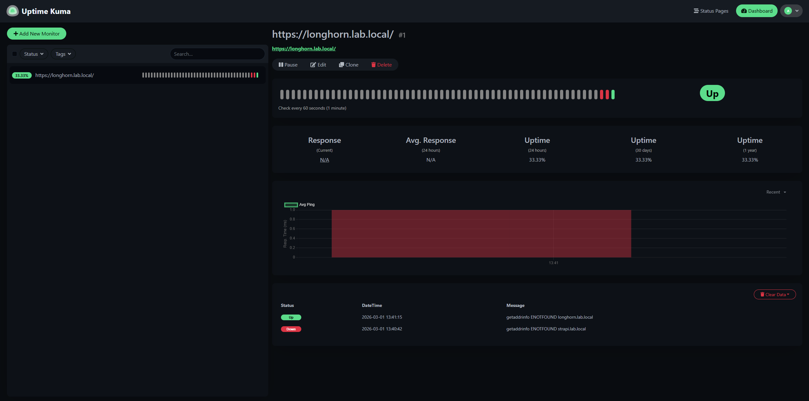
    </td>
    <td align="center" width="50%">
      <b>Longhorn — Distributed Storage with Zone Replicas</b><br/>
      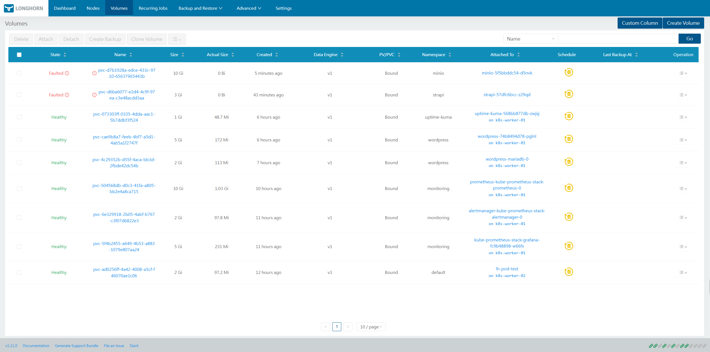
    </td>
  </tr>
  <tr>
    <td align="center" width="50%">
      <b>Proxmox VE — 2 Hosts, 3 VMs</b><br/>
      
    </td>
    <td align="center" width="50%">
      <b>N8N — Alertmanager → Telegram Workflow</b><br/>
      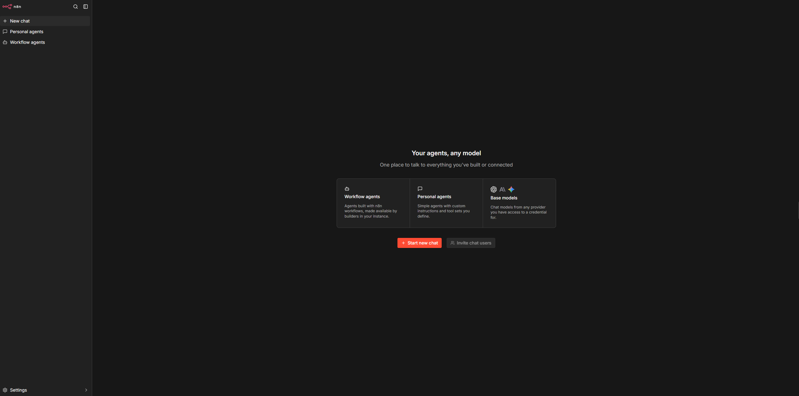
    </td>
  </tr>
</table>

<details>
<summary><b>🖼️ More Screenshots</b></summary>

| Argo CD | | |
|---|---|---|
| 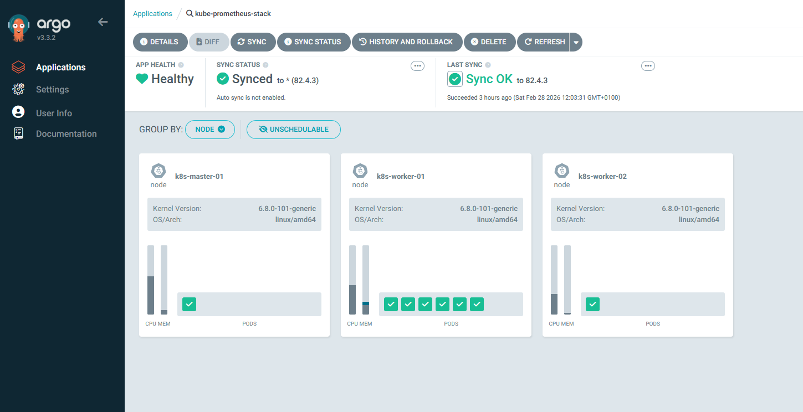 |  | 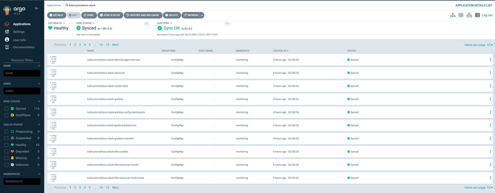 |

| Grafana | | |
|---|---|---|
| 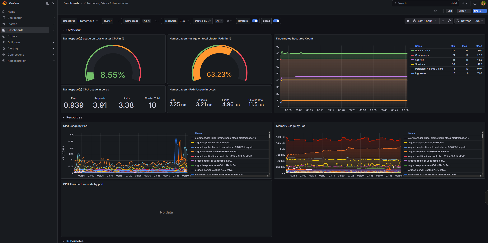 | 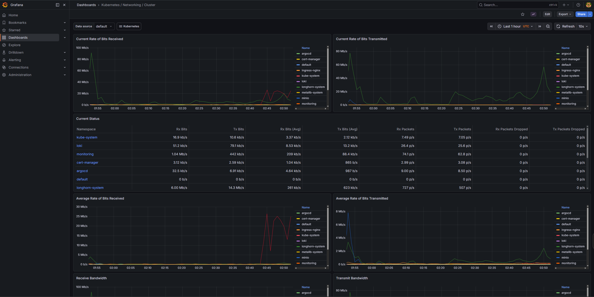 |  |

| MinIO | Strapi | WordPress |
|---|---|---|
|  | 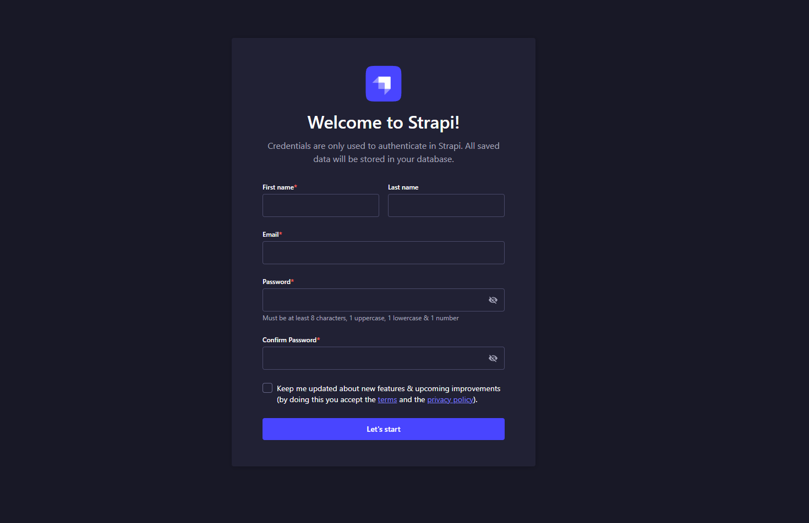 |  |

| Uptime Kuma | | Proxmox |
|---|---|---|
|  | 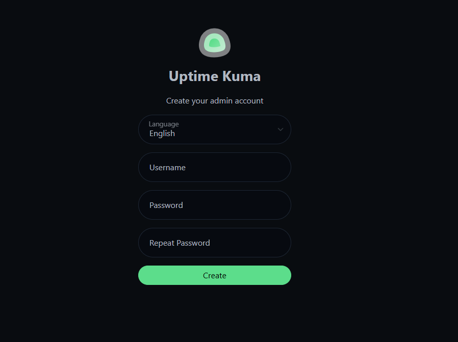 | 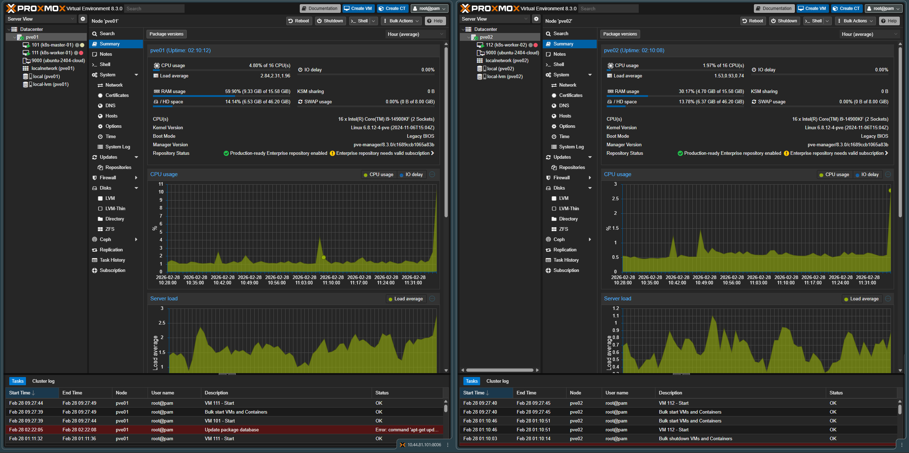 |

| N8N | | Longhorn |
|---|---|---|
| 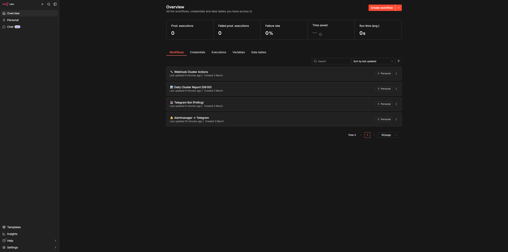 | 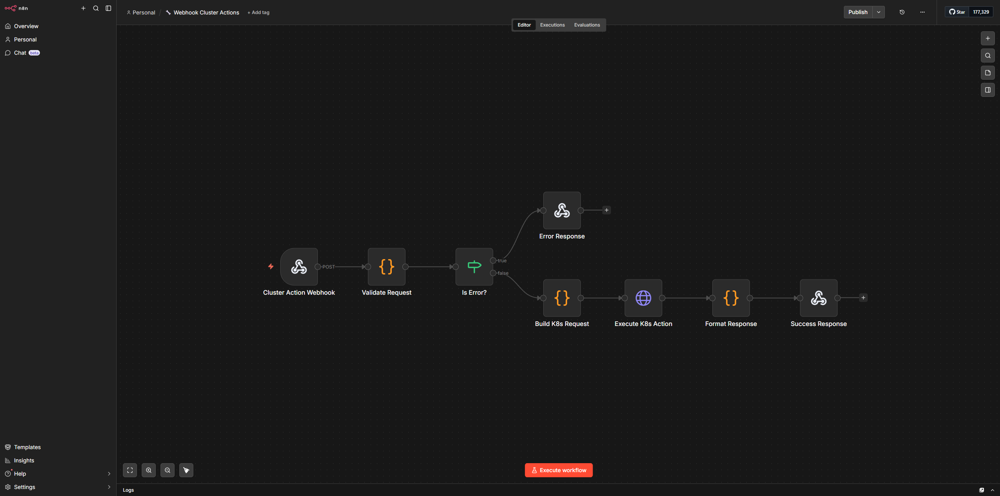 |  |

</details>

---
## 🧱 Technology Stack

| Layer | Technology | Version | Status |
|-------|-----------|---------|--------|
| **Virtualization** | Proxmox VE | 8.3.0 | ✅ |
| **IaC** | Terraform + bpg/proxmox | 1.14.6 / 0.97.1 | ✅ |
| **Configuration** | Ansible | core 2.16.3 | ✅ |
| **OS** | Ubuntu | 24.04.4 LTS (kernel 6.8.0-101) | ✅ |
| **Container Runtime** | containerd | 2.2.1 (master) / 1.7.28 (workers) | ✅ |
| **Kubernetes** | kubeadm | v1.31.14 | ✅ |
| **CNI** | Calico | v3.27.3 | ✅ |
| **Package Manager** | Helm | v3.20.0 | ✅ |
| **Load Balancer** | MetalLB (L2) | v0.15.3 | ✅ |
| **Ingress** | ingress-nginx | v1.14.3 | ✅ |
| **TLS** | cert-manager + internal CA | v1.19.4 | ✅ |
| **Storage** | Longhorn | v1.11.0 | ✅ |
| **Storage Backup Target** | Longhorn → MinIO (S3) | `type: bak` | ✅ |
| **CSI Snapshots** | external-snapshotter + snapshot-controller | v8.2.0 | ✅ |
| **VolumeSnapshotClass** | `longhorn-snapshot-class` (type: bak) | CRD | ✅ |
| **GitOps** | Argo CD | v3.3.2 | ✅ |
| **Monitoring** | kube-prometheus-stack | Prometheus v3.10.0 | ✅ |
| **Dashboards** | Grafana | 12.4.0 | ✅ |
| **Alerting** | Alertmanager → Telegram | CRD | ✅ |
| **Logs** | Loki (singleBinary) | v3.4.2 | ✅ |
| **Log Agent** | Promtail (DaemonSet, 3/3) | v3.0.0 | ✅ |
| **Metrics API** | metrics-server | v0.8.1 | ✅ |
| **Uptime Monitor** | Uptime Kuma | v2.1.3 | ✅ |
| **CMS (WordPress)** | WordPress + MariaDB (Bitnami Helm 29.1.2) | 6.8.2 + 11.8.3 | ✅ |
| **Headless CMS** | Strapi | v4.26.1 (node:18-alpine) | ✅ |
| **Object Storage** | MinIO | 2024-12-18 (chart 5.4.0) | ✅ |
| **Container Registry** | registry:2 (in-cluster, NodePort 30500) | — | ✅ |
| **Image Builder** | nerdctl + buildkitd (containerd-native, no Docker) | v2.2.1 / v0.26.3 | ✅ |
| **Wiki** | MkDocs Material + nginx:alpine (multi-stage Dockerfile) | 9.7+ | ✅ |
| **Backup/DR** | Velero + velero-plugin-for-aws | 1.17.1 + v1.13.0 | ✅ |
| **CI/CD** | GitHub Actions + ARC | v0.13.1 | ✅ |
| **Secrets** | Sealed Secrets | v2.18.3 | ✅ |
| **Workflow Automation** | N8N | v2.10.2 | ✅ |

---

## 🖥️ Infrastructure

### Physical Hosts

| Host | IP | CPU | RAM | Role |
|------|----|-----|-----|------|
| pve01 | 10.44.81.101 | 8 vCPU | 8 GB | Proxmox VE 8.3 — node 1 |
| pve02 | 10.44.81.102 | 8 vCPU | 8 GB | Proxmox VE 8.3 — node 2 |

### Kubernetes Cluster (VMs provisioned via Terraform)

| VM | IP | VMID | Host | Zone | Role | vCPU | RAM | Disk |
|----|----|------|------|------|------|------|-----|------|
| k8s-master-01 | 10.44.81.110 | 101 | pve01 | **zone-a** | control-plane | 2 | 4 GB | 20 GB |
| k8s-worker-01 | 10.44.81.111 | 111 | pve01 | **zone-a** | worker | 4 | 4 GB | 60 GB |
| k8s-worker-02 | 10.44.81.112 | 112 | pve02 | **zone-b** | worker | 4 | 4 GB | 60 GB |

> All VMs: Ubuntu 24.04.4 LTS, kernel 6.8.0-101-generic, cloud-init
> Zone labels: `topology.kubernetes.io/zone` + `topology.kubernetes.io/region=proxmox-lab`
> Workers: vCPU 2→4, disks expanded: 20 → 35 GB (Block E) → 60 GB (Block H) via Proxmox API + growpart

### Kubernetes Components

| Component | Namespace | Version | Status |
|-----------|-----------|---------|--------|
| Calico CNI | kube-system | v3.27.3, pod CIDR 192.168.0.0/16 | ✅ |
| MetalLB | metallb-system | v0.15.3, L2, pool 10.44.81.200–250 | ✅ |
| ingress-nginx | ingress-nginx | v1.14.3, EXTERNAL-IP: 10.44.81.200 | ✅ |
| cert-manager | cert-manager | v1.19.4, internal CA (lab-ca-issuer) | ✅ |
| Longhorn | longhorn-system | v1.11.0, SC: `longhorn` + `longhorn-single` | ✅ |
| Longhorn BackupTarget | longhorn-system | `s3://longhorn-backup@us-east-1/`, AVAILABLE | ✅ |
| external-snapshotter | kube-system | v8.2.0, 3 CRDs (VolumeSnapshot*) | ✅ |
| snapshot-controller | kube-system | 2 pods Running | ✅ |
| VolumeSnapshotClass | cluster | `longhorn-snapshot-class` (type: bak, DR-safe) | ✅ |
| metrics-server | kube-system | v0.8.1, managed by Argo CD | ✅ |
| Argo CD | argocd | v3.3.2, **17 apps** Synced/Healthy | ✅ |
| Sealed Secrets | kube-system | v2.18.3, sealed-secrets-controller | ✅ |
| kube-prometheus-stack | monitoring | Prometheus v3.10.0 + Grafana 12.4.0 + Alertmanager | ✅ |
| Loki | loki | v3.4.2, singleBinary, PVC 10Gi | ✅ |
| Promtail | loki | v3.0.0, DaemonSet 3/3 (all nodes) | ✅ |
| MinIO | minio | 2024-12-18, 10Gi PVC, ServiceMonitor (job=minio) | ✅ |
| Velero | velero | v1.17.1, BSL Available, `--features=EnableCSI` | ✅ |
| N8N | n8n | v2.10.2, 1/1 Running, PVC 5Gi Longhorn | ✅ |

---

## 🌐 Available Services (lab.local)

All services are exposed via HTTPS using an internal CA (`lab-ca-issuer`) and `*.lab.local` DNS — no self-signed certificate warnings.

| URL | Service | Version | Auth | Status |
|-----|---------|---------|------|--------|
| https://argocd.lab.local | Argo CD | v3.3.2 | Local admin | ✅ |
| https://grafana.lab.local | Grafana | 12.4.0 | Local admin | ✅ |
| https://longhorn.lab.local | Longhorn UI | v1.11.0 | — (disabled in lab) | ✅ |
| https://wordpress.lab.local | WordPress | 6.8.2 Bitnami | Local admin | ✅ |
| https://strapi.lab.local | Strapi CMS | v4.26.1 | Created on first login | ✅ |
| https://kuma.lab.local | Uptime Kuma | v2.1.3 | Created on first login | ✅ |
| https://minio.lab.local | MinIO Console | 2024-12-18 | S3 credentials | ✅ |
| https://wiki.lab.local | Wiki (MkDocs) | Material 9.7+ | Public | ✅ |
| https://n8n.lab.local | N8N | v2.10.2 | Created on first login | ✅ |
| https://app.lab.local | Test App | nginx | Public | ✅ |

> 🔐 Credentials and connection details: see [SECURITY.md](SECURITY.md) and [docs/DevOps.md](docs/DevOps.md).

---

## 📦 Applications & Services

| Application | Version | Namespace | URL | Key Features |
|------------|---------|-----------|-----|--------------|
| **WordPress** | 6.8.2 + MariaDB 11.8.3 | `wordpress` | https://wordpress.lab.local | Bitnami Helm 29.1.2. PVC: WP 2Gi + MariaDB 5Gi (Longhorn). Velero backup 02:00 UTC. **DR tested: ~3 min** ✅ |
| **Uptime Kuma** | v2.1.3 | `uptime-kuma` | https://kuma.lab.local | Self-hosted uptime monitor for all `lab.local`. WebSocket: Ingress `proxy-http-version: "1.1"`. PVC 1Gi. Velero backup 03:00 UTC |
| **Strapi CMS** | v4.26.1 | `strapi` | https://strapi.lab.local | Headless CMS. node:18-alpine. initContainer: `npm install` + `npm run build`. Production: `npm run start`. PVC 5Gi Longhorn |
| **Wiki (MkDocs)** | Material 9.7+ | `wiki` | https://wiki.lab.local | Multi-stage: `python:3.12-slim` → `mkdocs build` → `nginx:alpine`. **31 Lessons Learned**. Registry: `10.44.81.110:30500/wiki:latest` |
| **MinIO** | 2024-12-18 | `minio` | https://minio.lab.local | S3 backend for Velero + Longhorn BackupTarget. Prometheus ServiceMonitor (`job=minio`). Buckets: `velero`, `longhorn-backup` |
| **In-Cluster Registry** | registry:2 | `registry` | http://10.44.81.110:30500 | NodePort HTTP (insecure). Images: `wiki:latest`. containerd mirrors configured on all nodes |
| **N8N** | v2.10.2 | `n8n` | https://n8n.lab.local | Workflow automation. SQLite, Recreate strategy. PVC 5Gi Longhorn. Sealed Secrets: `N8N_ENCRYPTION_KEY` + `N8N_USER_MANAGEMENT_JWT_SECRET` |
| **metrics-server** | v0.8.1 | `kube-system` | — | Kubernetes Metrics API for `kubectl top` / HPA / VPA. Managed via Argo CD GitOps |

---

## 🐳 Image Builds (No Docker)

There is no Docker daemon in this lab. The Wiki is built using a **multi-stage Dockerfile** + **containerd-native toolchain**:

| Tool | Version | Role |
|------|---------|------|
| `containerd` | 2.2.1 (master) | Kubernetes container runtime (`SystemdCgroup = true`) |
| `nerdctl` | v2.2.1 | Docker-compatible CLI for containerd (`docker build/push/run`) |
| `buildkitd` | v0.26.3 | Build daemon (systemd service on master node) |

```bash
# Wiki Dockerfile: python:3.12-slim → mkdocs build → nginx:alpine
sudo nerdctl build -t 10.44.81.110:30500/wiki:latest .

# Push to in-cluster registry (HTTP, insecure)
sudo nerdctl push 10.44.81.110:30500/wiki:latest

# Roll out new image in Kubernetes
kubectl rollout restart deployment/wiki -n wiki
```

> ⚠️ containerd mirrors (`/etc/containerd/config.toml`) must be configured on all nodes to pull from insecure registry `10.44.81.110:30500`.

---

> 📋 **All 10 blocks (A–J) complete.** Full progress checklist with dates → [docs/roadmap-devops.md](docs/roadmap-devops.md)

## 📚 Skills Demonstrated

<details>
<summary><b>🏗️ Infrastructure as Code</b></summary>

- Proxmox VM provisioning with Terraform (`bpg/proxmox` provider v0.97.1)
- Full K8s cluster bootstrap via Ansible playbooks (kubeadm init + CNI + join)
- Repeatable, version-controlled infrastructure — 3 VMs with a single `terraform apply`
- VM disk expansion via Proxmox API + growpart (20 → 60 GB online, no downtime)

</details>

<details>
<summary><b>🚀 GitOps & Continuous Delivery</b></summary>

- Argo CD **App-of-Apps pattern** — single root Application manages 17 child apps
- All platform changes via `git push` — no manual `kubectl apply` in the workflow
- Automated sync + self-heal + pruning — cluster always converges to Git state
- GitHub Actions + ARC (Actions Runner Controller) — self-hosted runners in K8s, scale-from-zero
- Wiki CI: automatic multi-stage build → push to in-cluster registry → rolling restart on every push

</details>

<details>
<summary><b>📊 Observability Stack</b></summary>

- Prometheus v3.10.0 + 6 custom PrometheusRules (node/pod/PVC alerts)
- Grafana 12.4.0 — 3 dashboards provisioned via ConfigMap sidecars (GitOps, no manual import):
  - **Node Exporter — Lab** (CPU/Memory/Disk/Network)
  - **Kubernetes Cluster — Lab** (nodes, pods, restarts, namespace resources)
  - **Loki Logs — Lab** (log streams by namespace/pod, error rate)
- Loki v3.4.2 + Promtail DaemonSet (3/3 nodes) — full log aggregation
- Alertmanager → Telegram notification pipeline
- MinIO Prometheus ServiceMonitor (`job=minio`)

</details>

<details>
<summary><b>💾 Storage & Disaster Recovery</b></summary>

- Longhorn v1.11.0 distributed storage with zone-aware replicas (zone-a + zone-b)
- Two StorageClasses: `longhorn` (2 replicas, HA) + `longhorn-single` (1 replica, performance)
- CSI-native VolumeSnapshots with `type: bak` (DR-safe — survives namespace deletion)
- Velero v1.17.1 full cluster backup to MinIO (S3-compatible, `checksumAlgorithm: ""`)
- DR drill: full namespace delete → Velero restore → **HTTP 200 in ~3 minutes** ✅
- Velero backup schedules: WordPress daily 02:00 UTC, Uptime Kuma daily 03:00 UTC (TTL 30d)

> ⚠️ Key lesson: `type: snap` = internal snapshot → deleted with the namespace. Only `type: bak` is DR-safe!

</details>

<details>
<summary><b>🔒 Security</b></summary>

- Sealed Secrets v2.18.3 — encrypted secrets safe to commit to Git, decrypted only inside cluster
- cert-manager v1.19.4 with internal CA (`lab-ca-issuer`) — TLS on all services, no browser warnings
- RBAC per service (least-privilege ServiceAccounts, ARC RBAC)
- No Docker daemon — rootless builds with nerdctl + buildkitd (containerd-native)
- `.gitignore` excludes: `kubeconfig*.yaml`, SSH keys, `*.tfstate`, `terraform.tfvars`, certificates

</details>

<details>
<summary><b>⚡ Automation & Integrations</b></summary>

- N8N v2.10.2 workflows: Alertmanager alerts → Telegram, daily K8s health reports, Telegram bot
- Alertmanager → N8N Webhook → Telegram notification pipeline
- GitHub Actions CI/CD with self-hosted ARC runners inside Kubernetes (scale-from-zero)
- Wiki: push to GitHub → ARC runner → nerdctl build → push registry → kubectl rollout restart

</details>

<details>
<summary><b>🌐 High Availability & Zone Topology</b></summary>

- 2-zone topology: zone-a (pve01: master-01 + worker-01), zone-b (pve02: worker-02)
- Longhorn cross-zone replication confirmed: replicas on worker-01 (zone-a) + worker-02 (zone-b)
- **Zone A failure test**: cordoned master-01 + worker-01 → all 13 services migrated to zone-b ✅
- Rolling node removal/addition: `terraform` (new VM) → Ansible join → `kubectl cordon/drain/delete` → `terraform destroy` — full lifecycle tested
- MetalLB L2 with shared LoadBalancer IP pool (10.44.81.200–250)

</details>

---

<details>
<summary><b>✅ What Was Built — Block by Block</b></summary>


### Block A — Foundations
- ✅ GitHub repo with SSH key, `.gitignore` (kubeconfig, SSH keys, `*.tfstate`, certificates)
- ✅ Repository structure: `terraform/`, `ansible/`, `cluster/`, `apps/`, `wiki/`, `docs/`

### Block B — IaaS (Terraform + Proxmox)
- 2 Proxmox hosts (pve01: 10.44.81.101, pve02: 10.44.81.102)
- Terraform API tokens, cloud-image Ubuntu 24.04 on both nodes
- `terraform apply` — 3 VMs in one command (master + 2 workers)

### Block C — Configuration (Ansible)
- Playbook `kubeadm-cluster.yml`: swap off, sysctl, containerd, kubeadm
- `kubeadm init` + Calico CNI + join workers → **failed=0, all 3 nodes Ready**

### Block D — Kubernetes Platform Core
- ✅ MetalLB **v0.15.3** L2 — real external IPs from pool 10.44.81.200–250
- ✅ ingress-nginx **v1.14.3** → EXTERNAL-IP `10.44.81.200`
- ✅ cert-manager v1.19.4 + internal CA → TLS without browser warnings
- ✅ Longhorn **v1.11.0** — StorageClass: `longhorn` (2 replicas) + `longhorn-single` (1 replica)
- ✅ Longhorn HA: drain worker → PVC migrated to another node, data intact

### Block E — Observability
- ✅ Prometheus **v3.10.0** — `prometheus-0` Running, 10Gi PVC (Longhorn)
- ✅ Grafana **12.4.0** — `https://grafana.lab.local`, 5Gi PVC
- ✅ Alertmanager: 6 PrometheusRules + Telegram notifications
- ✅ **Loki v3.4.2** — singleBinary, namespace `loki`, PVC 10Gi
- ✅ **Promtail v3.0.0** — DaemonSet 3/3 Running (all 3 nodes)
- ✅ **4 Grafana dashboards** provisioned via GitOps ConfigMaps:
  - **Node Exporter — Lab** (CPU/Memory/Disk/Network)
  - **Kubernetes Cluster — Lab** (Nodes/Pods/restarts/namespace resources)
  - **Loki Logs — Lab** (logs by namespace/pod, error rate)
  - **Entra ID Security — Ciellos** v5 (40 panels: Security Alerts/Brute Force/Spray/Impossible Travel/First-time Countries, Auth Quality/Passwordless%/MFA Methods/CA Policies, User Insights/Privileged/Top IPs/Velocity, Weekly KPI Trends)

### Block F — GitOps + CI/CD (Argo CD + GitHub Actions + ARC)
- ✅ Argo CD **v3.3.2** via Helm — `https://argocd.lab.local`
- ✅ GitHub repo connected → STATUS: Successful
- ✅ **17 Applications**, all `Synced / Healthy`
- ✅ App-of-Apps pattern — single point of control for all services
- ✅ **GitHub Actions + ARC v0.13.1** — `wiki-ci.yml` pipeline, scale-from-zero runners in K8s
- ✅ **Sealed Secrets v2.18.3** — WordPress + N8N credentials encrypted in Git
- ✅ **ArgoCD auto-sync fix** — `timeout.reconciliation: 30s` (was 180s) + `pre-push` git hook → hard refresh all apps after every `git push` ✅

### Block G — Applications
- ✅ **WordPress 6.8.2** — Bitnami Helm 29.1.2 + Argo CD + Longhorn PVC + Ingress TLS
  - MariaDB 11.8.3, PVC 2Gi + 5Gi (Longhorn)
- ✅ **Uptime Kuma v2.1.3** — Argo CD + Longhorn PVC 1Gi
  - Monitors all `lab.local` + Kubernetes API
  - WebSocket requires Ingress annotation: `proxy-http-version: "1.1"`
- ✅ **Strapi v4.26.1** — node:18-alpine + Argo CD + Longhorn PVC 5Gi
  - initContainer: `npm install` + `npm run build` → production `npm run start`
  - ⚠️ v4 (not v5!) — npm registry for v5 contained breaking incompatibilities
- ✅ **Wiki (MkDocs Material 9.7+)** — multi-stage Docker build + nginx:alpine
  - **31 Lessons Learned** documented
  - Multi-stage Dockerfile: `python:3.12-slim` → `mkdocs build` → `nginx:alpine`
- ✅ **N8N v2.10.2** — Workflow automation, Argo CD GitOps, SQLite, Recreate strategy, PVC 5Gi
- ✅ **In-Cluster Registry (registry:2)** — NodePort 30500

### Block H — Backup / DR (Velero + MinIO)
- ✅ **MinIO 2024-12-18** — standalone, namespace `minio`, 10Gi `longhorn-single` PVC
  - Buckets: `velero` (FSB) + `longhorn-backup` (CSI)
  - Prometheus ServiceMonitor: `job=minio`
- ✅ **Velero v1.17.1** — BSL `default` → MinIO → **Available** ✅
  - `--features=EnableCSI`, `checksumAlgorithm: ""` (MinIO compatibility)
  - node-agent DaemonSet (kopia fs-backup for PVCs)
- ✅ **CSI Snapshot Infrastructure**
  - external-snapshotter v8.2.0: CRDs `VolumeSnapshot`, `VolumeSnapshotContent`, `VolumeSnapshotClass`
  - VolumeSnapshotClass `longhorn-snapshot-class`: `type: bak` **(DR-safe!)**
- ✅ **Longhorn BackupTarget** → MinIO `s3://longhorn-backup@us-east-1/` — AVAILABLE
- ✅ **Backup schedules**: WordPress daily 02:00 UTC, Uptime Kuma daily 03:00 UTC (TTL 30d)
- ✅ **DR Drill** — namespace `wordpress` deleted → Velero restore → WordPress **HTTP 200** ✅ (~3 minutes)
- ✅ Workers CPU 2 → 4 vCPU, disks 20 → 60 GB (growpart via Proxmox API)

> ⚠️ DR Lesson: `type: snap` = internal snapshot → deleted with namespace. `type: bak` = backup to external storage (MinIO) → **survives namespace deletion. Only `type: bak` is DR-safe!**

### Block I — Operations / Day-2
- ✅ **metrics-server v0.8.1** — Metrics API for HPA/VPA/`kubectl top`, managed by Argo CD
- ✅ Rolling Update + HPA + PDB — documented (Lessons 28, 29)
- ✅ Kubernetes upgrade v1.30 → v1.31.14 documented (Lesson 25)
- ✅ **Node add/remove test** — terraform (VM 113/pve02) → Ansible join → kubectl cordon/drain/delete → terraform destroy (via Proxmox API) — full lifecycle
- ✅ **Node maintenance workflow** — cordon → drain (`--ignore-daemonsets --delete-emptydir-data`) → delete → re-join (Lesson 30)

### Block J — AZ / Zone Topology
- ✅ **Zone labels** — `topology.kubernetes.io/zone`: master-01+worker-01 → `zone-a` (pve01), worker-02 → `zone-b` (pve02)
- ✅ **Longhorn cross-zone** — replicas confirmed: worker-01 (zone-a) + worker-02 (zone-b)
- ✅ **Zone A failure test** — cordoned master-01 + worker-01 → ALL 13 services on worker-02 (zone-b): WordPress, Grafana, Loki, MinIO, Strapi, Wiki, Registry, Velero, ingress-nginx ✅
- ✅ **Documented** — `cluster/platform/node-labels.yaml`, Lesson 31, runbooks updated

</details>

---

## 📖 Wiki — 31 Lessons Learned

Documentation available in the repository at `wiki/docs/`:

| Section | Content |
|---------|---------|
| **Lessons 1–13** | Velero/MinIO, Longhorn DR (`type: bak` vs `type: snap`), BackupTarget, external-snapshotter, Ingress-NGINX snippets, containerd SystemdCgroup, Longhorn prereqs/disk, MinIO race condition, Velero OutOfSync, cert-manager, Argo CD credentials, Calico CIDR |
| **Lesson 14** | Strapi v4 in Kubernetes — 10 gotchas (npm run develop/start, react deps, public/uploads, better-sqlite3, node versions) |
| **Lessons 15–20** | Proxmox disk resize, kubectl Windows, Velero distroless, Longhorn HA drain, version compatibility, general rules |
| **Lessons 21–23** | Windows SCP trailing slash, MinIO Console empty graphs, MinIO Audit Webhook vs Loki |
| **Lesson 24** | Argo CD App-of-Apps — why standalone `kubectl apply` is an anti-pattern |
| **Lesson 25** | Kubernetes upgrade kubeadm: v1.30 → v1.31 |
| **Lessons 26–27** | SLO/SLI in Kubernetes, Lens conflict with two Prometheus instances |
| **Lessons 28–29** | Rolling Update + HPA + PDB, RWO PVC + Rolling Update = Multi-Attach error |
| **Lesson 30** | Node add/remove: terraform + Ansible join + kubectl drain/delete + `terraform destroy` hung → Proxmox API rescue |
| **Lesson 31** | AZ/Zone Topology: zone labels, Longhorn cross-zone replicas, Zone A failure test |
| **Infrastructure** | Kubernetes, Longhorn, MetalLB, cert-manager |
| **Services** | WordPress, Strapi, MinIO, Wiki, Uptime Kuma, N8N |
| **Reference** | [docs/DevOps.md](docs/DevOps.md) — credentials, configs, commands |

---

## 📁 Repository Structure

```
.
├── terraform/proxmox-lab/          # VM provisioning (Terraform + bpg/proxmox)
├── ansible/
│   ├── inventory.ini               # 3-node cluster inventory
│   ├── kubeadm-cluster.yml         # Full K8s bootstrap playbook
│   └── 02-longhorn-prereqs.yml     # open-iscsi, iscsi_tcp
├── cluster/
│   ├── argocd/
│   │   └── ingress-argocd.yaml     # Argo CD Ingress + TLS
│   ├── apps/                       # Argo CD Application CRDs (17 apps)
│   │   ├── app-of-apps.yaml        # Root App-of-Apps entry point
│   │   ├── app-monitoring.yaml     # kube-prometheus-stack
│   │   ├── app-loki.yaml           # Loki v3.4.2 (logs)
│   │   ├── app-minio.yaml          # MinIO (S3 storage)
│   │   ├── app-velero.yaml         # Velero v1.17.1
│   │   ├── app-wordpress.yaml      # WordPress 6.8.2 Bitnami
│   │   ├── app-strapi.yaml         # Strapi v4.26.1
│   │   ├── app-wiki.yaml           # Wiki MkDocs Material
│   │   ├── app-n8n.yaml            # N8N v2.10.2
│   │   ├── app-uptime-kuma.yaml    # Uptime Kuma v2.1.3
│   │   ├── app-metrics-server.yaml # metrics-server v0.8.1
│   │   └── app-registry.yaml       # In-cluster registry:2
│   ├── arc/
│   │   └── rbac.yaml               # ARC RBAC: ServiceAccount + ClusterRole
│   ├── secrets/
│   │   └── wordpress-credentials.yaml # SealedSecret (encrypted, safe to commit)
│   ├── platform/
│   │   └── node-labels.yaml        # Zone topology labels (zone-a/zone-b)
│   ├── longhorn/
│   │   └── ingress-longhorn.yaml   # Longhorn UI Ingress + TLS
│   ├── storage/
│   │   ├── longhorn-backuptarget.yaml           # BackupTarget → MinIO
│   │   └── longhorn-volumesnapshotclass.yaml    # VolumeSnapshotClass (type: bak)
│   ├── dashboards/
│   │   ├── dashboard-node-exporter.yaml   # CPU/Memory/Disk/Network
│   │   ├── dashboard-k8s-cluster.yaml     # Nodes/Pods/NS resources
│   │   ├── dashboard-loki-logs.yaml       # Logs/Errors via Loki
│   │   └── dashboard-entra-id.yaml        # Entra ID Security v5 (40 panels: Security Alerts, Auth Quality, User Insights, Weekly KPI Trends)
│   └── monitoring/
│       ├── alertmanager-config.yaml       # AlertmanagerConfig (Telegram)
│       └── prometheus-rules.yaml          # PrometheusRule: 6 custom alerts
├── apps/
│   ├── n8n/                        # N8N: namespace, pvc, deployment, service, ingress, sealed-secret
│   ├── uptime-kuma/                # Uptime Kuma manifests
│   ├── strapi/                     # Strapi CMS manifests
│   ├── wiki/                       # Wiki manifests
│   └── longhorn-test/              # PVC + Pod persistence test
├── wiki/                           # Wiki source (MkDocs Material)
│   ├── Dockerfile                  # Multi-stage: python:3.12-slim → mkdocs build → nginx:alpine
│   ├── mkdocs.yml                  # MkDocs config
│   ├── requirements.txt            # Python deps (mkdocs-material 9.7+, plugins)
│   └── docs/                       # Wiki content (31 lessons, services, infra)
├── docs/
│   ├── DevOps.md                   # Reference: credentials, configs, commands
│   ├── roadmap-devops.md           # Progress checklist with dates
│   └── runbooks/
│       ├── cluster-bootstrap.md    # Terraform → Ansible → Argo CD (7 steps)
│       └── disaster-recovery.md    # Velero restore, Longhorn snapshot, node failure
└── .github/
    └── workflows/
        └── wiki-ci.yml             # GitHub Actions: wiki build & deploy (ARC runner)
```

---

## 🚀 Quick Start — How to Reproduce This Lab

### Prerequisites

- 2× physical servers (or VMs) with Proxmox VE installed
- Workstation with `kubectl`, `terraform`, `ansible`, `git`
- Network: `10.44.x.x/24` subnet

### Step 1 — Provision VMs with Terraform

```bash
cd terraform/proxmox-lab
cp terraform.tfvars.example terraform.tfvars   # fill in your Proxmox API tokens
terraform init && terraform apply
```

### Step 2 — Bootstrap Kubernetes with Ansible

```bash
cd ansible
ansible-playbook -i inventory.ini kubeadm-cluster.yml
ansible-playbook -i inventory.ini 02-longhorn-prereqs.yml
```

### Step 3 — Install Argo CD

```bash
kubectl create namespace argocd
kubectl apply -n argocd -f https://raw.githubusercontent.com/argoproj/argo-cd/stable/manifests/install.yaml
kubectl apply -f cluster/argocd/app-of-apps.yaml
```

### Step 4 — Let GitOps Do the Rest

```bash
# Argo CD will automatically sync all 17 apps from Git
kubectl get application -n argocd   # watch all apps sync
kubectl get pods -A                 # verify everything is Running
```

> See [docs/runbooks/cluster-bootstrap.md](docs/runbooks/cluster-bootstrap.md) for detailed step-by-step instructions.

### Key Commands

```bash
# SSH to cluster (user is 'ubuntu', not root!)
ssh -i ~/.ssh/devops-lab ubuntu@10.44.81.110

# Check all Argo CD apps
kubectl get application -n argocd

# Check all pods
kubectl get pods -A

# Metrics API
kubectl top nodes
kubectl top pods -A

# Velero backup status
kubectl get backupstoragelocation -n velero
kubectl get backup.velero.io -n velero
kubectl get schedule -n velero

# MinIO — verify buckets
kubectl exec -n minio deploy/minio -- mc alias set myminio http://localhost:9000 <MINIO_USER> <MINIO_PASSWORD> --api s3v4
kubectl exec -n minio deploy/minio -- mc ls myminio/
```

---

## 📋 Backlog — Next Steps

| Direction | Description | Priority |
|-----------|-------------|----------|
| **Security: NetworkPolicies** | Isolate namespaces (wordpress, strapi, argocd, monitoring...) | 🔴 High |
| **Security: RBAC** | Fine-grained RBAC for workloads, PodSecurityAdmission `restricted` | 🔴 High |
| **Kyverno** | Kubernetes-native policy engine: admission webhooks, mutation/validation | 🔴 High |
| **Harbor** | Self-hosted Container Registry with UI, RBAC, Trivy scanning — replaces `registry:2` | 🟡 Medium |
| **Argo Rollouts** | Canary / Blue-Green deployments via Argo CD | 🟡 Medium |
| **CI/CD: Trivy scan** | Image scanning as security gate in wiki-ci pipeline | 🟡 Medium |
| **GitLab CE** | Self-hosted GitLab on Proxmox (VM via Terraform) + GitLab Runner in K8s | 🟡 Medium |
| **KeyCloak** | SSO platform: bitnami/keycloak Helm, Microsoft OIDC / Google OAuth2 | 🟡 Medium |
| **LiteLLM + OpenWebUI** | AI stack: LiteLLM as unified gateway (Claude + Gemini), OpenWebUI interface | 🟡 Medium |
| **Grafana Tempo** | Distributed tracing — complements Grafana + Loki stack (OpenTelemetry) | 🟡 Medium |
| **MCP Server** | Model Context Protocol server in K8s: kubectl + Loki + Terraform tools for Claude | 🟢 Low |
| **KEDA** | Event-driven autoscaling: scale pods by queue depth (RabbitMQ, Kafka, Prometheus) | 🟢 Low |
| **Backstage** | Developer Portal: service catalog, documentation, TechDocs, templates | 🟢 Low |
| **ESO** | External Secrets Operator as alternative to Sealed Secrets | 🟢 Low |

---

## 👤 Author

**Dmytro Shevchenko** — Platform / DevOps Engineer specializing in virtualized and cloud-native infrastructure.

Extensive experience with on-prem virtualization (VMware, Proxmox) and Microsoft Azure (ARM/IaC, Entra ID, Intune, Exchange, DNS, security & governance).
Focused on Kubernetes, GitOps, infrastructure automation, and building resilient production platforms from the ground up.

**Senior Platform Engineer | Cloud Infrastructure | Azure | Kubernetes | IaC & Automation**

[](https://linkedin.com/in/dimitriy-shevchenko)
[](https://github.com/shevchenkod)

---

## 📄 License

MIT — see [LICENSE](LICENSE) for details.

> This is a **lab environment**. Credentials in documentation are **default lab values only**.
> Never use these credentials in production systems.

---

*Last updated: 13.03.2026 — Entra ID Security Dashboard v5 (40 panels: +Security Alerts, Auth Quality, User Insights, Weekly KPI Trends) ✅ | ArgoCD auto-sync fix (30s polling + pre-push hook) ✅ | 17 Argo CD Apps | Blocks A–J closed ✅ | 31 Lessons Learned in Wiki*
