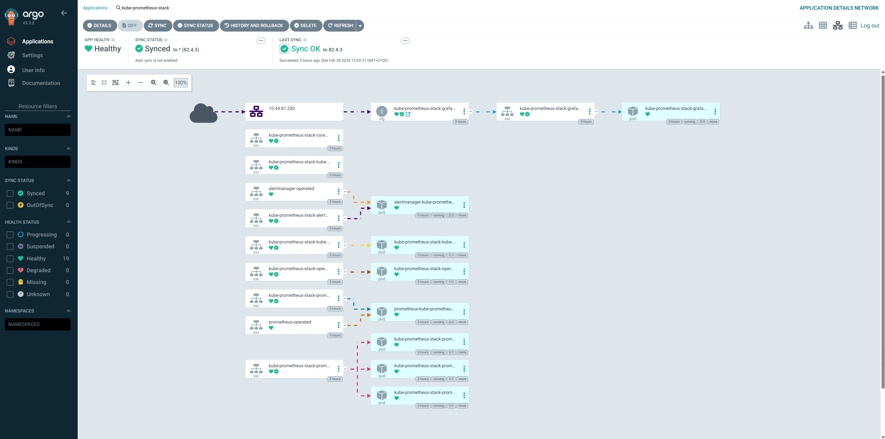

# 🚀 GitOps with Argo CD

> "What is in Git — is in the cluster." Argo CD watches the repository and automatically synchronises K8s with the code.

## Lab Configuration

| Parameter | Value |
|-----------|-------|
| Version | v2.14 |
| UI | [argocd.lab.local](https://argocd.lab.local) |
| Login | admin / `DevOpsLab2026!` |
| Repository | `https://github.com/shevchenkod/devops-lab.git` |
| Credential | HTTPS token (secret `argocd-repo-devops-lab`) |
| Namespace | `argocd` |

!!! warning "repoURL — always HTTPS"
    Argo CD uses HTTPS credentials. All `Application` manifests **must** have
    `repoURL: https://github.com/...`, not `git@github.com:...`.
    SSH works in CLI, but not in the Argo CD credential store for this lab.

## Argo CD Application Structure

```
cluster/
├── argocd/
│   ├── app-of-apps.yaml      # ◄ ROOT: watches cluster/apps/, manages everything
│   └── ingress-argocd.yaml   # Ingress for Argo CD UI
└── apps/
    ├── app-wordpress.yaml
    ├── app-uptime-kuma.yaml
    ├── app-strapi.yaml
    ├── app-registry.yaml
    ├── app-wiki.yaml
    ├── app-monitoring.yaml
    ├── app-loki.yaml
    ├── app-promtail.yaml
    ├── app-minio.yaml
    ├── app-velero.yaml
    ├── app-dashboards.yaml
    └── app-test-app.yaml
```

## App-of-Apps Pattern

> **App-of-Apps** is a parent Application that watches the `cluster/apps/` directory
> and automatically creates all child Application objects on `git push`.

```
app-of-apps (root Application)
  └── watches: cluster/apps/    ◄── all app-*.yaml files go here
        ├── app-wordpress.yaml    → Application: wordpress
        ├── app-minio.yaml        → Application: minio
        ├── app-wiki.yaml         → Application: wiki
        └── ... (12 total)
```

**Workflow for adding a new service:**

```bash
# 1. Create the Application manifest
# cat cluster/apps/app-newservice.yaml

# 2. Push
git add cluster/apps/app-newservice.yaml
git commit -m "feat: add newservice"
git push

# 3. Argo CD will auto-discover + deploy within ~3 minutes
# kubectl apply is no longer needed!
```

!!! note "One manual step"
    The root Application is applied manually once during bootstrap of a new cluster:
    ```bash
    kubectl apply -f cluster/argocd/app-of-apps.yaml
    ```
    After that, everything is managed through git.

## Application Template

```yaml
apiVersion: argoproj.io/v1alpha1
kind: Application
metadata:
  name: my-app
  namespace: argocd
spec:
  project: default
  source:
    repoURL: https://github.com/shevchenkod/devops-lab.git
    targetRevision: HEAD
    path: apps/my-app
  destination:
    server: https://kubernetes.default.svc
    namespace: my-app
  syncPolicy:
    automated:
      prune: true
      selfHeal: true
    syncOptions:
      - CreateNamespace=true
```

## Key Commands

```powershell
# Apply root Application (once, during cluster bootstrap)
kubectl apply -f cluster/argocd/app-of-apps.yaml

# Status of all applications
kubectl get applications -n argocd

# Force sync (if Argo CD is stuck)
kubectl patch application wiki -n argocd `
  -p '{"operation":{"sync":{"revision":"HEAD"}}}' --type=merge

# Hard refresh (rebuilds cache)
kubectl annotate application wiki -n argocd `
  argocd.argoproj.io/refresh=hard --overwrite
```

## Current Applications

| Application | Type | Source / Chart Version | Namespace | Status |
|-------------|------|----------------------|-----------|--------|
| `wordpress` | Helm | bitnami/wordpress **29.1.2** | wordpress | ✅ Healthy |
| `kube-prometheus-stack` | Helm | prometheus-community **82.4.3** | monitoring | ✅ Healthy |
| `loki` | Helm | grafana/loki **6.29.0** | loki | ✅ Healthy |
| `promtail` | Helm | grafana/promtail **6.16.6** | loki | ✅ Healthy |
| `minio` | Helm | minio/minio **5.4.0** | minio | ✅ Healthy |
| `velero` | Helm | vmware-tanzu/velero **11.4.0** | velero | ✅ Healthy |
| `strapi` | Git | `apps/strapi` @ `90d2cf4` | strapi | ✅ Healthy |
| `registry` | Git | `cluster/registry` @ `90d2cf4` | registry | ✅ Healthy |
| `wiki` | Git | `apps/wiki` @ `90d2cf4` | wiki | ✅ Healthy |
| `uptime-kuma` | Git | `apps/uptime-kuma` @ `90d2cf4` | uptime-kuma | ✅ Healthy |
| `grafana-dashboards` | Git | `cluster/dashboards` @ `90d2cf4` | monitoring | ✅ Healthy |
| `test-app` | Git | `apps/test-app` @ `90d2cf4` | default | ✅ Healthy |

!!! tip "GitOps workflow"
    1. Edit the manifest locally
    2. `git commit && git push`
    3. Argo CD detects the change within ~3 minutes and syncs
    4. Or force-sync via `kubectl patch application ...`

---

## Screenshots

Argo CD UI — visual monitoring of all 12 cluster applications.

<figure markdown="span">
  { loading=lazy }
  <figcaption>Home page — list of 12 applications, all <strong>Synced / Healthy</strong></figcaption>
</figure>

<figure markdown="span">
  { loading=lazy }
  <figcaption>Application details — status, namespace, target repository</figcaption>
</figure>

<figure markdown="span">
  { loading=lazy }
  <figcaption>Resource graph: Deployment / ReplicaSet / Pod / Service / Ingress</figcaption>
</figure>

<figure markdown="span">
  { loading=lazy }
  <figcaption>Sync history — commits, rollback</figcaption>
</figure>

<figure markdown="span">
  { loading=lazy }
  <figcaption>Connected Git repositories and settings</figcaption>
</figure>
