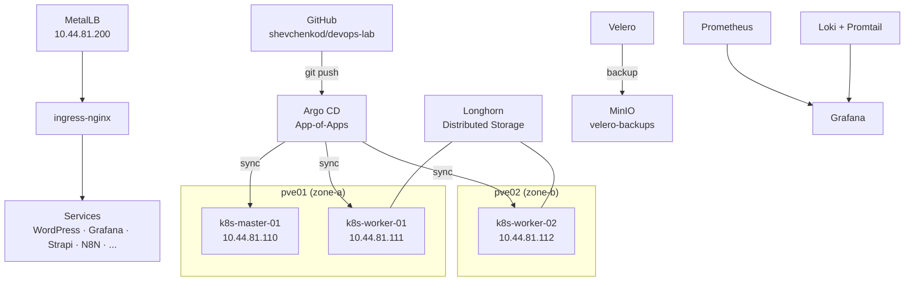

# DevOps Full-Cycle Homelab Platform

> A production-grade homelab covering the complete DevOps lifecycle — Infrastructure as Code, Kubernetes, GitOps, Observability, Backup & DR, and Automation.

---

## 🗺️ Platform at a Glance

| Component | Details |
|-----------|---------|
| Hypervisors | 2× Proxmox VE (pve01 + pve02) |
| Kubernetes | 3-node cluster (v1.31), kubeadm |
| GitOps | 17 Argo CD apps, App-of-Apps pattern |
| Networking | MetalLB L2 + nginx-ingress |
| TLS | cert-manager + internal CA (`lab-ca-issuer`) |
| Storage | Longhorn distributed block storage |
| Backup & DR | Velero + MinIO (S3-compatible) |
| CI/CD | Self-hosted GitHub Actions (ARC) + Sealed Secrets |

```
Physical: 2× Proxmox VE (pve01 10.44.81.101 · pve02 10.44.81.102)
  └── 3× Ubuntu VM (K8s)
        ├── master    10.44.81.110  (control plane) [zone-a / pve01]
        ├── worker-01 10.44.81.111  (worker)        [zone-a / pve01]
        └── worker-02 10.44.81.112  (worker)        [zone-b / pve02]
```

---

## 🌐 Lab Services

| Service | URL | Login | Status |
|---------|-----|-------|--------|
| **Argo CD** | [argocd.lab.local](https://argocd.lab.local) | admin / `DevOpsLab2026!` | ✅ |
| **Grafana** | [grafana.lab.local](https://grafana.lab.local) | admin / `DevOpsLab2026!` | ✅ |
| **Longhorn** | [longhorn.lab.local](https://longhorn.lab.local) | — | ✅ |
| **MinIO** | [minio.lab.local](https://minio.lab.local) | minioadmin / `DevOpsLab2026!` | ✅ |
| **Uptime Kuma** | [kuma.lab.local](https://kuma.lab.local) | *(created on first login)* | ✅ |
| **WordPress** | [wordpress.lab.local](https://wordpress.lab.local) | admin / `DevOpsLab2026!` | ✅ |
| **Strapi** | [strapi.lab.local](https://strapi.lab.local) | *(created on first login)* | ✅ |
| **Wiki** | [wiki.lab.local](https://wiki.lab.local) | — | ✅ |
| **N8N** | [n8n.lab.local](https://n8n.lab.local) | *(created on first login)* | ✅ |
| **Proxmox pve01** | [10.44.81.101:8006](https://10.44.81.101:8006) | root / `P@ssw0rd!` | ✅ |
| **Proxmox pve02** | [10.44.81.102:8006](https://10.44.81.102:8006) | root / `P@ssw0rd!` | ✅ |

> 🔐 TLS: all `*.lab.local` domains use an internal CA (`lab-ca-issuer`), imported into Windows.
> Add entries to `C:\Windows\System32\drivers\etc\hosts` → `10.44.81.200` (MetalLB IP).

---

## 🏗️ What You Will Learn

Working through this lab gives you hands-on experience with:

- **Infrastructure as Code** — Terraform + Proxmox provider, VM lifecycle management
- **Configuration Management** — Ansible playbooks for Kubernetes bootstrap
- **Kubernetes** — kubeadm cluster setup, CNI, storage, networking, upgrades (v1.30 → v1.31)
- **GitOps** — Argo CD App-of-Apps pattern, declarative application delivery
- **Observability** — Prometheus, Grafana dashboards, Loki log aggregation, Alertmanager → Telegram
- **SLO / SLI** — error budgets, multi-window burn-rate alerts, PromQL recording rules
- **Backup & DR** — Velero + MinIO, CSI snapshots (`type: bak`), full DR drills
- **Security** — cert-manager TLS (internal CA), Sealed Secrets, SSH key-based access
- **Day-2 Operations** — Rolling updates, HPA, PDB, node add/remove, cluster upgrades
- **Availability Zones** — zone topology labels, Longhorn cross-zone replication, zone failure testing
- **Self-hosted CI/CD** — GitHub Actions ARC runners, image builds with `nerdctl` + `buildkitd`

---

## 🧱 Platform Architecture



---

## 🧱 Technology Stack

=== "Infrastructure"

    | Tool | Version | Status |
    |------|---------|--------|
    | Proxmox VE | 8.3.0 | ✅ |
    | Kubernetes (kubeadm) | v1.31.14 | ✅ |
    | containerd | 2.2.1 (master) / 1.7.28 (workers) | ✅ |
    | Calico (CNI) | v3.27.3 | ✅ |
    | MetalLB (L2) | v0.15.3 | ✅ |
    | ingress-nginx | v1.14.3 | ✅ |
    | cert-manager | v1.19.4 | ✅ |
    | Longhorn | v1.11.0 | ✅ |
    | MinIO (standalone) | chart 5.4.0 | ✅ |
    | metrics-server | v0.8.1 | ✅ |

=== "GitOps & CI/CD"

    | Tool | Version | Status |
    |------|---------|--------|
    | Argo CD | v3.3.2 | ✅ |
    | GitHub (repo) | — | ✅ |
    | GitHub Actions + ARC | v0.13.1 | ✅ |
    | Sealed Secrets | v2.18.3 | ✅ |
    | Helm | v3.20.0 | ✅ |

=== "IaC"

    | Tool | Version | Status |
    |------|---------|--------|
    | Terraform + bpg/proxmox | 1.14.6 / 0.97.1 | ✅ |
    | Ansible | core 2.16.3 | ✅ |

=== "Observability"

    | Tool | Version | Status |
    |------|---------|--------|
    | Prometheus (kube-prometheus-stack) | v3.10.0 | ✅ |
    | Grafana | 12.4.0 | ✅ |
    | Loki (singleBinary) | v3.4.2 | ✅ |
    | Promtail (DaemonSet) | v3.0.0 | ✅ |
    | Alertmanager → Telegram | CRD | ✅ |
    | Uptime Kuma | v2.1.3 | ✅ |

=== "Services"

    | Tool | Version | Status |
    |------|---------|--------|
    | WordPress + MariaDB | 6.8.2 + 11.8.3 | ✅ |
    | Strapi | v4.26.1 | ✅ |
    | N8N | v2.10.2 | ✅ |
    | Wiki (MkDocs Material) | 9.7+ | ✅ |
    | registry:2 (in-cluster) | NodePort 30500 | ✅ |
    | Velero + velero-plugin-for-aws | 1.17.1 + v1.13.0 | ✅ |

---

## 📋 Roadmap — Block Status

| Block | Title | Status |
|-------|-------|--------|
| [A](roadmap/block-a.md) | Foundations: repository, standards | ✅ Done |
| [B](roadmap/block-b.md) | IaaS: Proxmox + Terraform | ✅ Done |
| [C](roadmap/block-c.md) | Configuration: Ansible | ✅ Done |
| [D](roadmap/block-d.md) | Kubernetes Platform Core | ✅ Done |
| [E](roadmap/block-e.md) | Observability: metrics, logs, alerts | ✅ Done |
| [F](roadmap/block-f.md) | Delivery: Helm, GitOps, CI/CD | ✅ Done |
| [G](roadmap/block-g.md) | Applications: real-world services | ✅ Done |
| [H](roadmap/block-h.md) | Backup / DR: Velero + MinIO | ✅ Done |
| [I](roadmap/block-i.md) | Operations / Day-2: metrics-server, HPA, Rolling, PDB, Node add/remove | ✅ Done |
| [J](roadmap/block-j.md) | AZ / Zone simulation: zone labels, Longhorn cross-zone, Zone A failure test | ✅ Done |

---

## ⚠️ Important

!!! danger "Read BEFORE doing anything for the first time"
    The [Lessons Learned](lessons/index.md) section contains real-world pitfalls from practice.
    Every item represents lost time and a found solution.

!!! tip "Quick Start"
    ```powershell
    # Set KUBECONFIG in each new PowerShell session
    $env:KUBECONFIG = "H:\DEVOPS-LAB\kubeconfig-lab.yaml"

    # SSH to master
    ssh -i "H:\DEVOPS-LAB\ssh\devops-lab" ubuntu@10.44.81.110
    ```

---

## 🔗 Key Sections

- [Infrastructure](infrastructure/index.md) — Proxmox, Kubernetes, Networking, Storage
- [GitOps](gitops/index.md) — Argo CD App-of-Apps pattern
- [Backup & DR](backup/index.md) — Velero + MinIO, DR drills
- [Security](security/index.md) — cert-manager, Sealed Secrets
- [Lessons Learned](lessons/index.md) — Real-world gotchas and solutions
- [Roadmap](roadmap/index.md) — Full progress checklist

---

*Repository: [github.com/shevchenkod/devops-lab](https://github.com/shevchenkod/devops-lab)*
