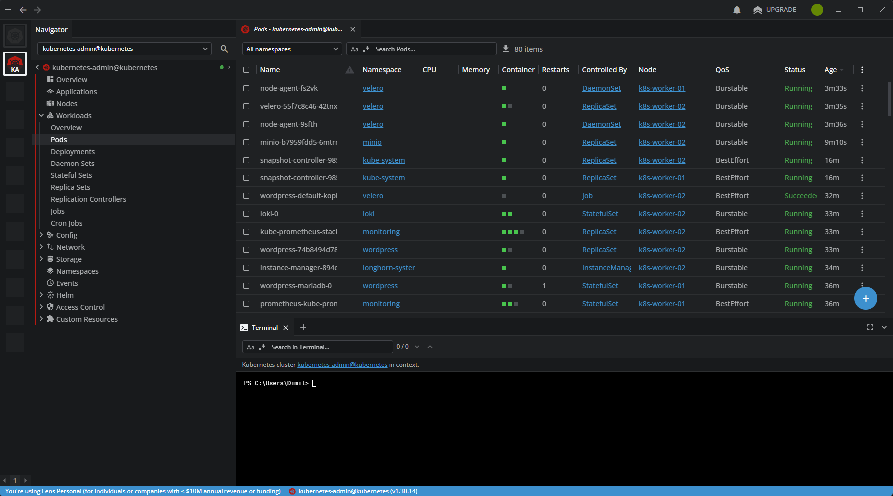
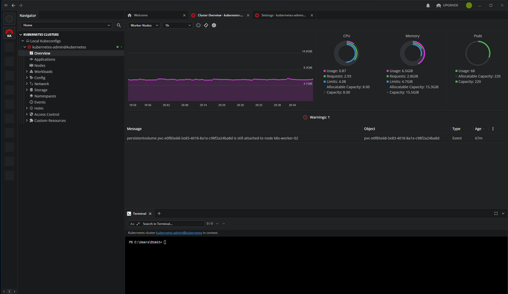

# ☸️ Kubernetes Cluster

> kubeadm cluster v1.31.14 on 3 Ubuntu VMs running on Proxmox VE.
> containerd 2.2.1 (master) / 1.7.28 (workers), Calico CNI, MetalLB LoadBalancer.

## Cluster Configuration

| Parameter | Value |
|-----------|-------|
| Kubernetes version | v1.31.14 |
| Setup method | kubeadm |
| Container runtime (master) | containerd 2.2.1 |
| Container runtime (workers) | containerd 1.7.28 |
| CNI | Calico |
| OS | Ubuntu 24.04.4 LTS |
| Kernel | 6.8.0-101-generic |
| kubeconfig | `H:\DEVOPS-LAB\kubeconfig-lab.yaml` |
| API server | `https://10.44.81.110:6443` |

## Nodes

| Role | Hostname | IP | CPU | RAM | OS |
|------|----------|----|-----|-----|----|
| Control Plane | k8s-master-01 | 10.44.81.110 | 8 vCPU | 8 GB | Ubuntu 24.04.4 LTS |
| Worker | k8s-worker-01 | 10.44.81.111 | 4 vCPU | 4 GB | Ubuntu 24.04.4 LTS |
| Worker | k8s-worker-02 | 10.44.81.112 | 4 vCPU | 4 GB | Ubuntu 24.04.4 LTS |

!!! tip "Master node upgrade"
    01.01.2026: master node upgraded from 2 CPU / 4 GB to 8 CPU / 8 GB for stable control plane operation.
    containerd on master updated to v2.2.1, config migrated from `version = 2` to `version = 3`.
    Insecure registry configured via `/etc/containerd/certs.d/10.44.81.110:30500/hosts.toml`.

## Quick Commands

```powershell
# Set KUBECONFIG (each new session)
$env:KUBECONFIG = "H:\DEVOPS-LAB\kubeconfig-lab.yaml"

# Node status
kubectl get nodes -o wide

# All pods
kubectl get pods -A

# Namespaces
kubectl get ns
```

```bash
# On master — system component status
kubectl get pods -n kube-system
kubectl get pods -n cert-manager
kubectl get pods -n ingress-nginx
kubectl get pods -n metallb-system
kubectl get pods -n longhorn-system
```

## Useful kubectl Commands

```bash
# Pod logs
kubectl logs -n <namespace> <pod-name> --tail=100 -f

# Exec into pod
kubectl exec -it -n <namespace> <pod-name> -- /bin/sh

# Describe resource (events, status)
kubectl describe pod -n <namespace> <pod-name>

# Scale deployment
kubectl scale deployment <name> -n <namespace> --replicas=0

# Restart deployment
kubectl rollout restart deployment/<name> -n <namespace>

# Port-forward
kubectl port-forward -n <namespace> svc/<service> 8080:80
```

## Lab Namespaces

| Namespace | Purpose | Status |
|-----------|---------|--------|
| `kube-system` | System components (etcd, apiserver, coredns, calico) | ✅ |
| `cert-manager` | TLS certificates (lab-ca-issuer) | ✅ |
| `ingress-nginx` | Ingress controller (LB: 10.44.81.200) | ✅ |
| `metallb-system` | MetalLB LoadBalancer | ✅ |
| `longhorn-system` | Distributed block storage | ✅ |
| `argocd` | Argo CD GitOps | ✅ |
| `monitoring` | Prometheus + Grafana + Alertmanager | ✅ |
| `loki` | Loki + Promtail logs | ✅ |
| `minio` | MinIO object storage (S3-compatible) | ✅ |
| `velero` | Backup (Velero + Kopia) | ✅ |
| `registry` | In-cluster Docker Registry | ✅ |
| `wordpress` | WordPress + MariaDB | ✅ |
| `strapi` | Strapi Headless CMS | ✅ |
| `uptime-kuma` | Uptime monitoring | ✅ |
| `wiki` | MkDocs Wiki | ✅ |
| `default` | test-app (smoke test) | ✅ |

## StorageClasses (Longhorn)

| StorageClass | Replicas | Purpose |
|-------------|----------|---------|
| `longhorn` (default) | 2 | Production data |
| `longhorn-single` | 1 | Lab apps (saves disk space) |
| `longhorn-static` | 2 | Static PVs |

!!! warning "Use longhorn-single for lab apps"
    With 2 worker nodes, `longhorn` reserves space on both — capacity fills up quickly.
    For lab applications always use `longhorn-single` (1 replica).

---

## Screenshots

<figure markdown="span">
  { loading=lazy }
  <figcaption>Lens IDE — cluster overview: nodes, pods, CPU/RAM usage</figcaption>
</figure>

<figure markdown="span">
  { loading=lazy }
  <figcaption>Lens Cluster Overview — both panels (Nodes + Pods) working after removing the conflicting lens-metrics namespace</figcaption>
</figure>
