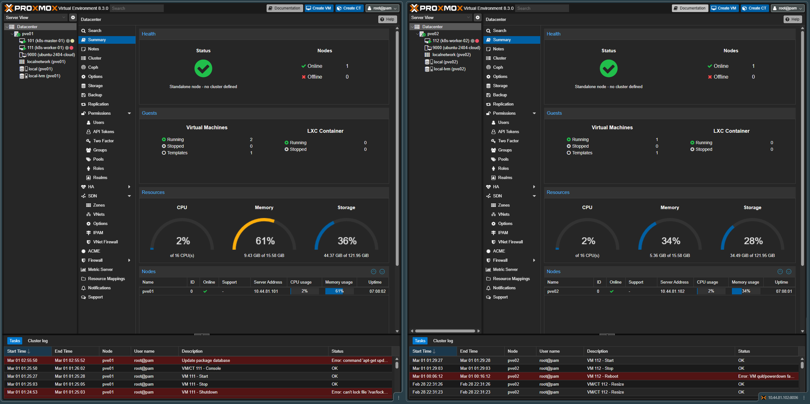

# 🖥️ Proxmox VE

> Enterprise-grade type-1 hypervisor (free). Foundation of the homelab.
> Two physical hosts running Ubuntu 24.04 VMs provisioned by Terraform.

## Lab Hosts

| Host | IP | FQDN | Zone | Web UI |
|------|----|------|------|--------|
| **pve01** | `10.44.81.101` | `pve01.devops.local` | zone-a | https://10.44.81.101:8006 |
| **pve02** | `10.44.81.102` | `pve02.devops.local` | zone-b | https://10.44.81.102:8006 |

## VM Inventory

| VMID | Hostname | Host | IP | Role | vCPU | RAM |
|------|----------|------|----|------|------|-----|
| 110 | k8s-master-01 | pve01 | 10.44.81.110 | Control Plane | 8 | 8 GB |
| 111 | k8s-worker-01 | pve01 | 10.44.81.111 | Worker (zone-a) | 4 | 4 GB |
| 112 | k8s-worker-02 | pve02 | 10.44.81.112 | Worker (zone-b) | 4 | 4 GB |

## Network (Bridges)

Both hosts use the same bridge configuration:

| Interface | Type | CIDR | Gateway |
|-----------|------|------|---------|
| `vmbr0` | Linux Bridge | `10.44.81.x/24` | `10.44.81.254` |

**Lab network diagram:**

```
10.44.81.0/24  (Management + Nodes + LB)
├── 10.44.81.101   pve01 (Proxmox)
├── 10.44.81.102   pve02 (Proxmox)
├── 10.44.81.110   k8s-master-01
├── 10.44.81.111   k8s-worker-01
├── 10.44.81.112   k8s-worker-02
└── 10.44.81.200+  MetalLB IP pool (LoadBalancer services)
```

## Storage Pools

| ID | Type | Content | Notes |
|----|------|---------|-------|
| `local` | Directory | ISO, CT templates, VZDump | For images and backups |
| `local-lvm` | LVM-Thin | Disk images, containers | VM/CT disks (thin provisioning) |

## Useful Proxmox Commands

```bash
# List VMs
qm list

# Start / stop VM
qm start <vmid>
qm stop <vmid>

# Create snapshot
qm snapshot <vmid> snap1 --description "Before update"

# Clone VM (full)
qm clone <vmid> <new-vmid> --name new-vm --full

# List LXC containers
pct list
```

## SSH Access

```bash
# SSH to master node (lab key)
ssh -i H:\DEVOPS-LAB\ssh\devops-lab ubuntu@10.44.81.110

# SSH to worker nodes
ssh -i H:\DEVOPS-LAB\ssh\devops-lab ubuntu@10.44.81.111
ssh -i H:\DEVOPS-LAB\ssh\devops-lab ubuntu@10.44.81.112
```

!!! note "SSH user"
    All K8s nodes use the `ubuntu` user with ED25519 key authentication.
    Proxmox hosts are accessed via the Web UI or root SSH with API tokens for Terraform.

## Terraform Integration

VMs are provisioned using the `bpg/proxmox` Terraform provider with API token authentication (not username/password). See `terraform/proxmox-lab/` for the full configuration.

```hcl
# Example provider configuration
provider "proxmox" {
  endpoint  = "https://10.44.81.101:8006"
  api_token = "<terraform-api-token>"
  insecure  = true
}
```

!!! warning "API token typo in pve02"
    The pve02 Terraform token ID was created with a typo: `terrafor` (missing `m`).
    This is the actual value stored in Proxmox — use it as-is.

## Template Directories

| Path | Purpose |
|------|---------|
| `/var/lib/vz/template/iso/` | ISO images (installation disks) |
| `/var/lib/vz/template/cache/` | LXC CT templates |
| `/var/lib/vz/template/cloud/` | Cloud images for VM templates (cloud-init) |

---

## Screenshots

<figure markdown="span">
  { loading=lazy }
  <figcaption>Datacenter view — both nodes pve01 / pve02, VM list</figcaption>
</figure>

<figure markdown="span">
  { loading=lazy }
  <figcaption>Node resources — CPU, RAM, storage, networking</figcaption>
</figure>
