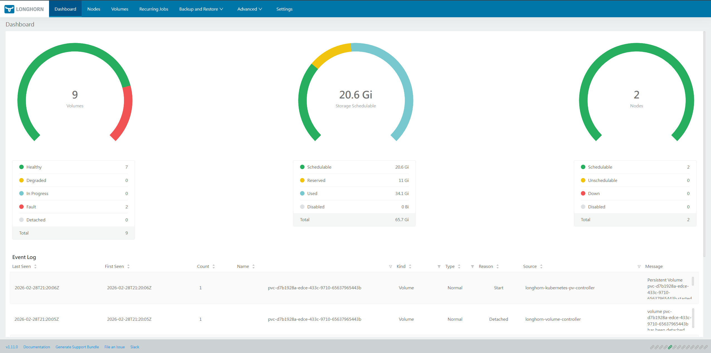
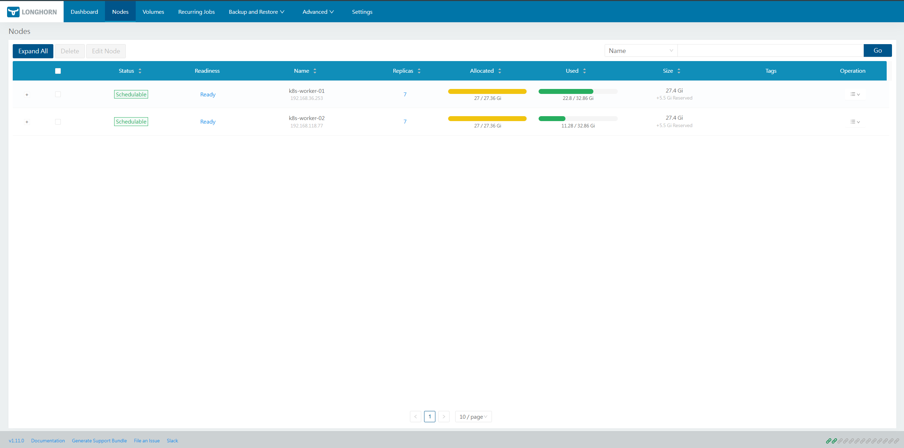

# 🗄️ Longhorn — Distributed Block Storage

> Distributed block storage for Kubernetes. Provides persistent storage with replication and snapshots.

## Lab Configuration

| Parameter | Value |
|-----------|-------|
| Namespace | `longhorn-system` |
| Running pods | 23 |
| defaultDataPath | `/var/lib/longhorn` |
| defaultClassReplicaCount | `2` (for 2 worker nodes) |
| StorageClass (default, 2 replicas) | `longhorn` |
| StorageClass (static) | `longhorn-static` |
| StorageClass (1 replica, lab apps) | `longhorn-single` |
| UI | `https://longhorn.lab.local` (Ingress + TLS) |
| Ingress manifest | `cluster/longhorn/ingress-longhorn.yaml` |

## StorageClasses

| StorageClass | Replicas | Use For |
|-------------|----------|---------|
| `longhorn` (default) | 2 | Stateful HA apps (WordPress, Prometheus, Grafana, Loki) |
| `longhorn-single` | 1 | MinIO (owns its own redundancy), lab apps |
| `longhorn-static` | 2 | Static PVs |

!!! warning "Capacity planning with 2 workers"
    With 2 worker nodes, `longhorn` reserves space on both — fills up quickly at >82% scheduled.
    For lab applications always use `longhorn-single` (1 replica).

    | Node | Available | Max | Scheduled | % |
    |------|-----------|-----|-----------|---|
    | k8s-worker-01 | ~11.4 GiB | 32.8 GiB | ~27 GiB | 82% |
    | k8s-worker-02 | ~23 GiB | 32.8 GiB | ~27 GiB | 82% |

## Installation via Helm

```bash
helm repo add longhorn https://charts.longhorn.io
helm repo update

# ⚠️ Important: defaultClassReplicaCount=2 for 2 worker nodes (not 3!)
# Otherwise PVCs will stay in Pending — more replicas than nodes
helm upgrade --install longhorn longhorn/longhorn \
  --namespace longhorn-system \
  --create-namespace \
  --set defaultSettings.defaultDataPath='/var/lib/longhorn' \
  --set persistence.defaultClassReplicaCount=2
```

## Access UI

```bash
# Via Ingress (lab): https://longhorn.lab.local
# Add to hosts: 10.44.81.200 longhorn.lab.local

# Or via port-forward:
kubectl -n longhorn-system port-forward svc/longhorn-frontend 8080:80
# Open: http://localhost:8080
```

## StorageClass YAML

```yaml
apiVersion: storage.k8s.io/v1
kind: StorageClass
metadata:
  name: longhorn
  annotations:
    storageclass.kubernetes.io/is-default-class: "true"
provisioner: driver.longhorn.io
reclaimPolicy: Delete
volumeBindingMode: Immediate
parameters:
  numberOfReplicas: "2"
  staleReplicaTimeout: "2880"
---
# longhorn-single — 1 replica (saves disk space in lab)
apiVersion: storage.k8s.io/v1
kind: StorageClass
metadata:
  name: longhorn-single
provisioner: driver.longhorn.io
allowVolumeExpansion: true
parameters:
  numberOfReplicas: "1"
  staleReplicaTimeout: "30"
```

## CSI Snapshots / DR

!!! warning "Use type: bak for DR-safe snapshots"
    Always use `VolumeSnapshotClass: longhorn-snapshot-class` with `type: bak` — NOT `type: snap`.
    `type: snap` data is deleted with the volume and is **not DR-safe**.

## Lab Testing (01.01.2026)

```bash
# Test PVC + Pod
kubectl apply -f apps/longhorn-test/pvc-test.yaml
kubectl get pvc lh-pvc-test          # STATUS: Bound, 2Gi
kubectl get pod lh-pod-test -o wide  # Running on k8s-worker-01

# Write data
kubectl exec -it lh-pod-test -- sh -c 'date > /data/hello.txt && cat /data/hello.txt'
# → Sat Feb 28 09:41:52 UTC 2026

# Persistence test
kubectl delete pod lh-pod-test
kubectl apply -f apps/longhorn-test/pvc-test.yaml
kubectl exec -it lh-pod-test -- sh -c 'cat /data/hello.txt'
# → Sat Feb 28 09:41:52 UTC 2026  ✅ data survived

# HA test (node drain)
kubectl drain k8s-worker-01 --ignore-daemonsets --delete-emptydir-data --force
kubectl apply -f apps/longhorn-test/pvc-test.yaml
# Pod recreated on k8s-worker-02 ✅ — Longhorn remounted volume from replica
kubectl exec -it lh-pod-test -- sh -c 'cat /data/hello.txt'
# → Sat Feb 28 09:41:52 UTC 2026  ✅ data intact
kubectl uncordon k8s-worker-01
```

---

## Screenshots

<figure markdown="span">
  { loading=lazy }
  <figcaption>Dashboard — volume state, nodes, disk usage</figcaption>
</figure>

<figure markdown="span">
  { loading=lazy }
  <figcaption>All PV / Volume list — size, replicas, status</figcaption>
</figure>

<figure markdown="span">
  { loading=lazy }
  <figcaption>Node details — disks, replicas, available space</figcaption>
</figure>
