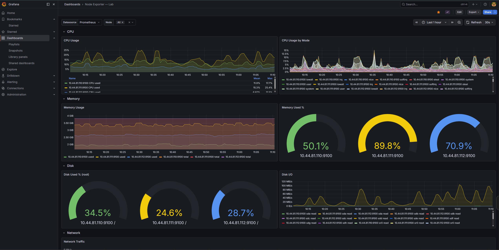

# 📈 Grafana

> Visualization for everything — dashboards for metrics, logs, and traces.

## Lab Configuration

| Parameter | Value |
|-----------|-------|
| UI | `https://grafana.lab.local` |
| Login | Local admin account |
| Namespace | `monitoring` |
| PVC | 5Gi (Longhorn) |
| Helm chart | bundled with `kube-prometheus-stack` |

## Retrieve Admin Password

```powershell
$s = kubectl get secret kube-prometheus-stack-grafana -n monitoring -o jsonpath="{.data.admin-password}"
[System.Text.Encoding]::UTF8.GetString([System.Convert]::FromBase64String($s))
```

## Popular Dashboards (import by ID)

| ID | Name |
|----|------|
| 1860 | Node Exporter Full |
| 315 | Kubernetes cluster monitoring |
| 13502 | Loki - Logs |
| 6417 | Kubernetes Pods |
| 17900 | Proxmox VE monitoring |
| 11600 | Alertmanager |

---

## Screenshots

<figure markdown="span">
  { loading=lazy }
  <figcaption>Home page — list of lab dashboards</figcaption>
</figure>

<figure markdown="span">
  { loading=lazy }
  <figcaption>Node Exporter Full — CPU, RAM, disk metrics for cluster nodes</figcaption>
</figure>

<figure markdown="span">
  { loading=lazy }
  <figcaption>Kubernetes Pods — load by pod and namespace</figcaption>
</figure>

<figure markdown="span">
  { loading=lazy }
  <figcaption>Loki — centralized service logs</figcaption>
</figure>

<figure markdown="span">
  { loading=lazy }
  <figcaption>Alertmanager — current alerts and grouping</figcaption>
</figure>
