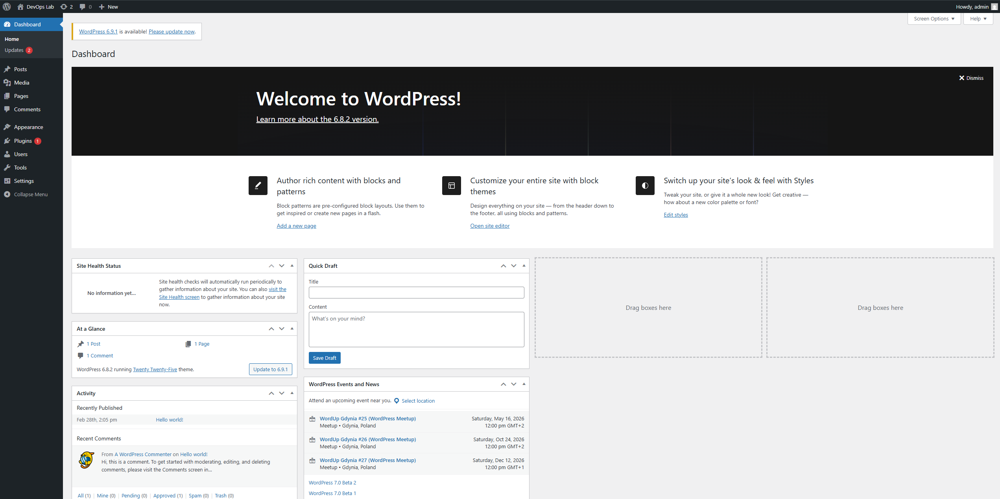
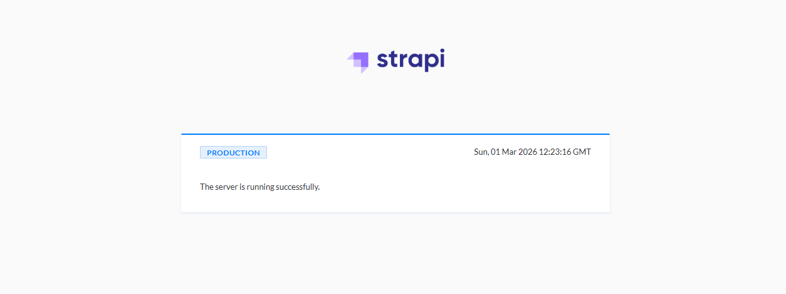
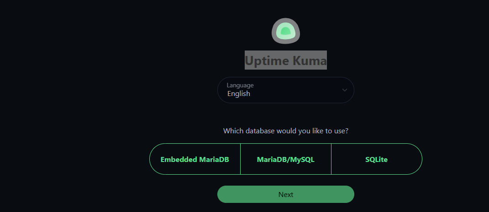
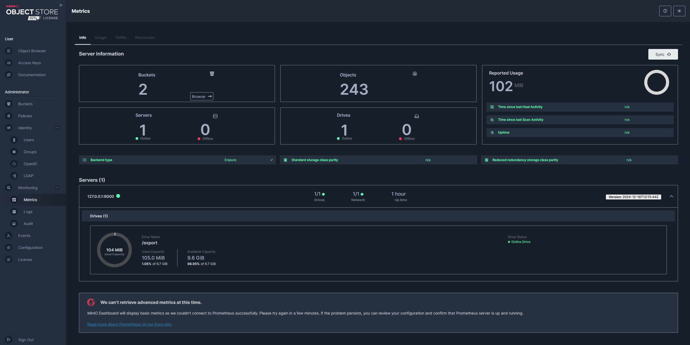

# 📦 Services

Applications deployed to the Kubernetes lab cluster via Argo CD.

## Summary Table

| Service | Namespace | URL | Helm Chart | Status |
|---------|-----------|-----|-----------|--------|
| [WordPress](wordpress.md) | `wordpress` | [wordpress.lab.local](https://wordpress.lab.local) | wordpress 29.1.2 | ✅ |
| [Strapi CMS](strapi.md) | `strapi` | [strapi.lab.local](https://strapi.lab.local) | custom | ✅ |
| [Wiki (MkDocs)](wiki.md) | `wiki` | [wiki.lab.local](https://wiki.lab.local) | custom | ✅ |
| [In-Cluster Registry](registry.md) | `registry` | `http://10.44.81.110:30500` | custom | ✅ |
| [Uptime Kuma](uptime-kuma.md) | `uptime-kuma` | [kuma.lab.local](https://kuma.lab.local) | custom | ✅ |
| [MinIO](minio.md) | `minio` | [minio.lab.local](https://minio.lab.local) | minio 5.4.0 | ✅ |
| Grafana | `monitoring` | [grafana.lab.local](https://grafana.lab.local) | kube-prometheus-stack 82.4.3 | ✅ |
| Argo CD | `argocd` | [argocd.lab.local](https://argocd.lab.local) | — | ✅ |
| Longhorn UI | `longhorn-system` | [longhorn.lab.local](https://longhorn.lab.local) | — | ✅ |

## Deployment Pattern

All services are deployed the same way via GitOps:

```
apps/<service>/
├── namespace.yaml
├── deployment.yaml
├── service.yaml
└── ingress.yaml       ← TLS via cert-manager lab-ca-issuer

cluster/argocd/
└── app-<service>.yaml ← Argo CD Application
```

!!! tip "Argo CD watches Git"
    After `git push`, Argo CD picks up the change within ~3 minutes.
    Force sync: `kubectl patch application <name> -n argocd -p '{"operation":{"sync":{"revision":"HEAD"}}}' --type=merge`

---

## Screenshots

<figure markdown="span">
  { loading=lazy }
  <figcaption>WordPress — lab site main page</figcaption>
</figure>

<figure markdown="span">
  { loading=lazy }
  <figcaption>Strapi CMS — Content Manager, managing entries</figcaption>
</figure>

<figure markdown="span">
  { loading=lazy }
  <figcaption>Strapi CMS — Media Library and plugin settings</figcaption>
</figure>

<figure markdown="span">
  { loading=lazy }
  <figcaption>Uptime Kuma — availability monitoring dashboard for all services</figcaption>
</figure>

<figure markdown="span">
  { loading=lazy }
  <figcaption>Uptime Kuma — uptime history and SLA</figcaption>
</figure>

<figure markdown="span">
  { loading=lazy }
  <figcaption>Uptime Kuma — notification settings</figcaption>
</figure>

<figure markdown="span">
  { loading=lazy }
  <figcaption>MinIO Console — lab S3 bucket list</figcaption>
</figure>
